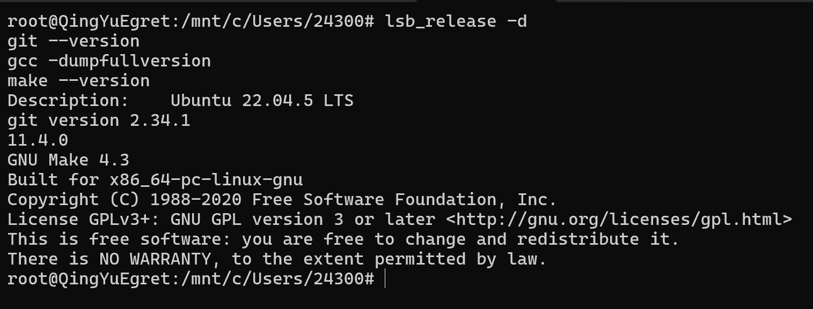
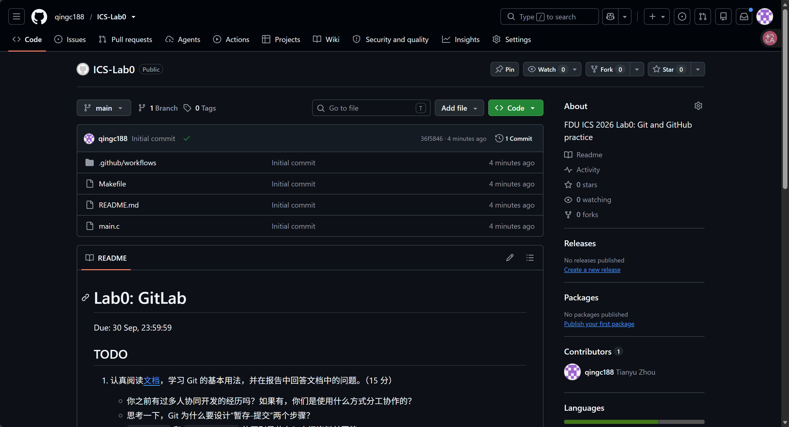
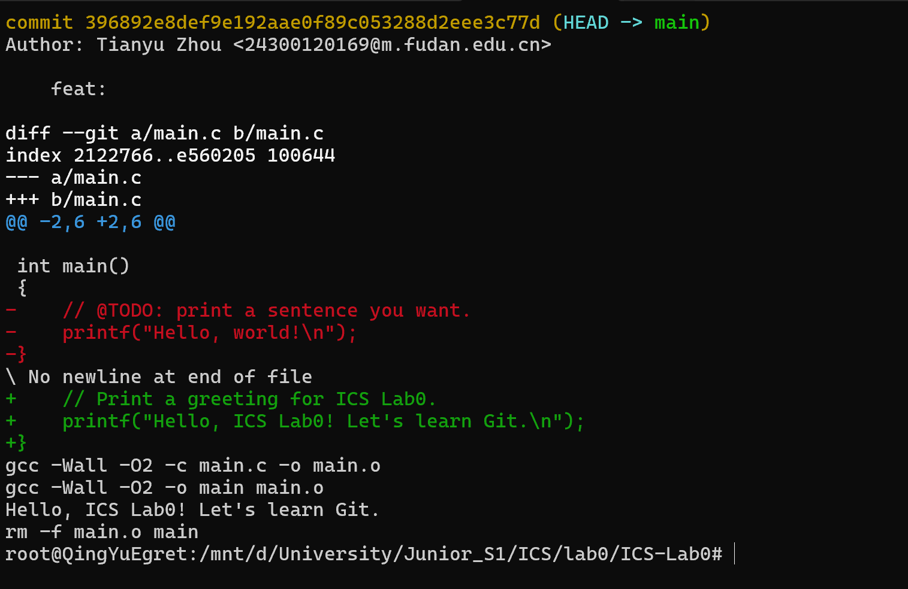
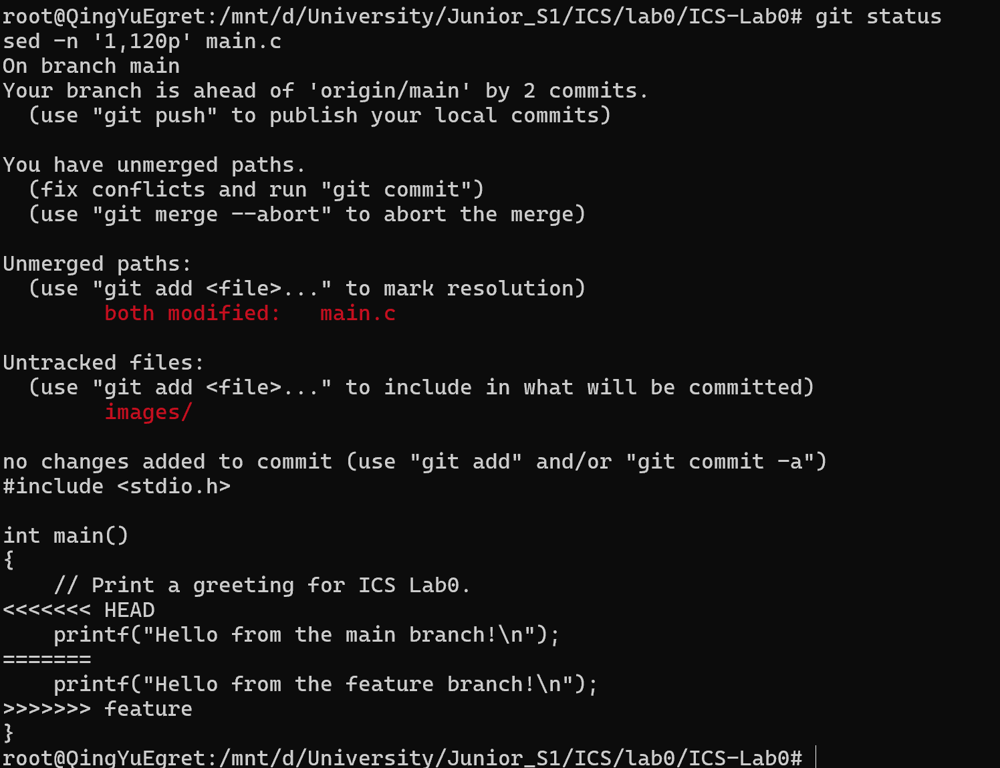
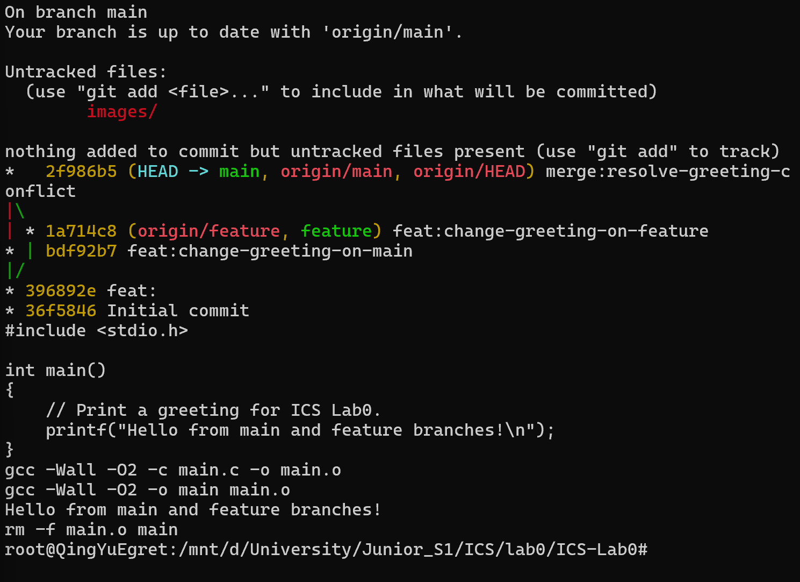

# ICS Lab0 实验报告：Git 与 GitHub

- 姓名：Tianyu Zhou
- 学号：24300120169
- GitHub 仓库：https://github.com/qingc188/ICS-Lab0
- 实验环境：Windows 11 + WSL 2（Ubuntu 22.04.5 LTS，x86-64）

## 1. 实验目标

本实验的目标是熟悉 Git 的基本提交流程、GitHub 远程仓库的使用方式，以及分支创建、合并和冲突解决的过程。实验中使用课程模板创建个人仓库，修改并运行 `main.c`，在 `main` 与 `feature` 分支上制造实际的内容冲突，再手动解决冲突并提交。

## 2. 实验环境

本实验在 WSL 2 的 Ubuntu 22.04.5 LTS 环境中完成。使用的工具包括 Git 2.34.1、GCC 11.4.0 和 GNU Make 4.3。



## 3. Git 与 GitHub 配置

我使用课程提供的模板仓库创建了公开个人仓库 `qingc188/ICS-Lab0`，并将其克隆到本地。Git 提交身份配置为姓名 `Tianyu Zhou`、邮箱 `24300120169@m.fudan.edu.cn`。本地完成提交后，通过 `git push` 将分支与提交历史同步到 GitHub。



## 4. 文档问题回答

### 4.1 多人协同开发经历

我最近在与另一名同学合作搭建 Linguistic Online Judge 网站，使用 GitHub 托管代码。我们按功能分工，在各自的分支上开发，再通过 Pull Request 合并到 `main`。例如，在开发公开题目展示功能时，我负责题目目录和浏览页面相关代码，另一位同学同时调整题目信息的组织方式。由于双方都修改了部分相邻的代码和字段定义，合并时出现了修改覆盖和内容冲突。我们通过比较两个分支的改动，保留需要的题目信息和页面展示逻辑，再重新测试后完成合并。这让我认识到，多人开发不仅需要完成各自的功能，还需要及时同步代码，并在合并前后仔细检查修改内容。

### 4.2 Git 为什么设计“暂存-提交”两个步骤

我认为“暂存-提交”最重要的作用是让一次提交只包含同一件事情相关的修改。实际开发时，工作区可能同时存在功能代码、调试代码、文档修改等不同性质的变动；使用 `git add` 可以选择其中需要进入本次历史记录的文件或代码块，而不是把所有尚未完成的修改一次性提交。

此外，暂存区提供了提交前的检查点。可以通过 `git diff --cached` 确认即将提交的内容，及时发现误加入的文件或遗漏的修改。这样形成的提交粒度更清晰，后续查看历史、定位问题、回退某一项修改，以及多人协作时审查和合并代码都会更容易。

### 4.3 `git branch` 与 `git branch -a` 的区别

`git branch` 默认只列出本地分支，例如本实验中的 `main` 与 `feature`。`git branch -a` 会同时列出本地分支和本地已知的远程跟踪分支，例如 `remotes/origin/main`、`remotes/origin/feature`。其中，`-a` 不会主动访问远程仓库；如果需要获取远程最新的分支信息，还应先执行 `git fetch` 或 `git pull`。

## 5. 修改 `main.c` 与首次提交

模板中的 `main.c` 初始输出为 `Hello, world!`。我将输出修改为 `Hello, ICS Lab0! Let's learn Git.`，然后依次执行：

```bash
git add main.c
git commit -m "..."
make
./main
make clean
```

程序可以成功编译运行，说明修改后的 C 程序和 Makefile 工作正常。



## 6. 分支管理、冲突与解决

为了确保合并时产生内容冲突，我让两个分支从同一个提交出发，并修改 `main.c` 中同一行 `printf` 语句。

1. 在 `main` 分支完成首次提交后，执行 `git switch -c feature` 创建并切换到 `feature` 分支。
2. 在 `feature` 分支中，将输出改为 `Hello from the feature branch!`，并提交。
3. 切换回 `main` 分支，将同一行改为 `Hello from the main branch!`，并提交。
4. 在 `main` 分支执行 `git merge feature`。由于两个分支都修改了同一位置，Git 无法自动判断保留哪一条输出，因此报告 `CONFLICT (content)`，并将 `main.c` 标记为 `both modified`。

冲突发生时，`<<<<<<< HEAD` 到 `=======` 之间是当前 `main` 分支的内容，`=======` 到 `>>>>>>> feature` 之间是准备合并的 `feature` 分支内容。



我检查两边的内容后，手动删除冲突标记，并将最终输出确定为：

```c
printf("Hello from main and feature branches!\n");
```

随后执行：

```bash
git add main.c
git commit -m "merge:resolve-greeting-conflict"
make
./main
make clean
```

最后的提交图显示，合并提交同时具有 `main` 和 `feature` 两个父提交；程序也成功输出合并后的问候语。



## 7. 阅读材料

### 7.1 Commit Message 规范

我阅读了阮一峰的《Commit message 和 Change log 编写指南》。文章说明，清晰且格式化的提交说明可以帮助开发者快速理解项目历史、按类型筛选变动，并自动生成 Change log。文章介绍的常见格式为 `<type>(<scope>): <subject>`，其中 `type` 可使用 `feat`、`fix`、`docs`、`refactor` 等类别，`scope` 用于说明影响范围，`subject` 用简洁的动词短语概括本次修改。

我认为该规范的价值不在于机械地套用格式，而在于让每个提交都能清楚回答“改了什么、为什么改”。这次实验中，分支修改和冲突解决分别对应独立提交，提交历史因此能够反映完整的操作过程。

阅读链接：https://www.ruanyifeng.com/blog/2016/01/commit_message_change_log.html

### 7.2 语义化版本

同时我也阅读了《语义化版本 2.0.0》。语义化版本使用 `主版本号.次版本号.修订号` 的格式：当出现不兼容的 API 修改时增加主版本号；当加入向下兼容的新功能时增加次版本号；当进行向下兼容的问题修正时增加修订号。规范还定义了先行版本和构建信息的表示方式。

语义化版本的核心作用是用版本号向使用者传达兼容性信息，降低依赖升级时的不确定性。对协作项目而言，开发者可以据此判断升级的风险，并在发布新功能或破坏性改动时作出更明确的说明。

阅读链接：https://semver.org/lang/zh-CN/

## 8. 对于为什么要学习 Git 的理解

结合本次实验和 Linguistic Online Judge 的协作经历，我认为 Git 是开发过程中的基础工具。它首先能保存清晰的版本历史，使开发者可以查看每次修改、比较版本差异，并在出现问题时回退到可用版本。其次，分支可以把不同功能的开发隔离开，避免未完成的实验性修改直接影响稳定的主分支。

更重要的是，Git 为多人协作提供了共同的代码整合流程。团队成员可以在各自分支独立工作，通过提交记录和 Pull Request 交流修改内容，再将确认后的代码合并到主分支。本次实验中的冲突也说明：当多人修改同一位置时，Git 不会擅自选择某一份代码，而是要求开发者理解两边的意图后作出明确决定。因此，学习 Git 不只是学习几条命令，也是学习以可追踪、可审查的方式管理代码变更。

## 9. 实验总结

本实验完成了从创建远程仓库、克隆、修改、暂存、提交、推送，到创建分支、制造冲突、解决冲突和合并的完整 Git 流程。通过实际操作，我更清楚地理解了本地提交与远程推送的区别，以及分支和合并在协作开发中的作用。后续开发中，我会继续保持小步提交、使用明确提交说明、合并前同步代码并及时处理冲突的习惯。
